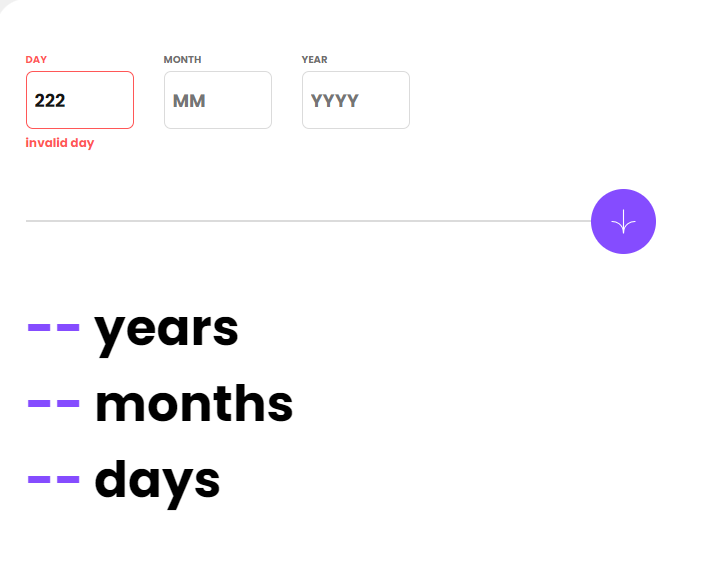

# Age calculator app with HTML/CSS and JavaScript

## Table of contents

- [Overview](#overview)
  - [The challenge](#the-challenge)
  - [Screenshot](#screenshot)
  - [Links](#links)
- [My process](#my-process)
  - [Built with](#built-with)
  - [What I learned](#what-i-learned)
- [Author](#author)

## Overview

### The challenge

Users should be able to:

- View an age in years, months, and days after submitting a valid date through the form
- Receive validation errors if:
  - Any field is empty when the form is submitted
  - The day number is not between 1-31
  - The month number is not between 1-12
  - The year is in the future
  - The date is invalid e.g. 31/04/1991 (there are 30 days in April)
- View the optimal layout for the interface depending on their device's screen size
- See hover and focus states for all interactive elements on the page

### Screenshot

- Desktop Design


- Tablet Design


- Mobile Design


- Error States



- Success state


### Links

- Solution URL: [Code URL](https://github.com/MelakuAlehegn/age-calculator-app)
- Live Site URL: [Live Url](https://melakualehegn.github.io/age-calculator-app/)

## My process

### Built with

- Semantic HTML5 markup
- CSS custom properties
- Flexbox
- Mobile-first workflow
- JavaScript DOM

### What I learned

I have been able to use JavaScript to manipulate DOM and apply setTimeout() function of javascript to render data and remove it after some time.
To see how you can add code snippets, see below:

```js
setTimeout(() => {
            alertYear.textContent = "";
            yearlabel.style.color = "hsl(0, 1%, 44%)"
            yearInput.style.border = "1px solid hsl(0, 0%, 86%)"
        }, 4000);
```

## Author

- Frontend Mentor - [@melakualehegn](https://www.frontendmentor.io/profile/melakualehegn)
- Twitter - [@MelakuA5](https://www.twitter.com/MelakuA5)
